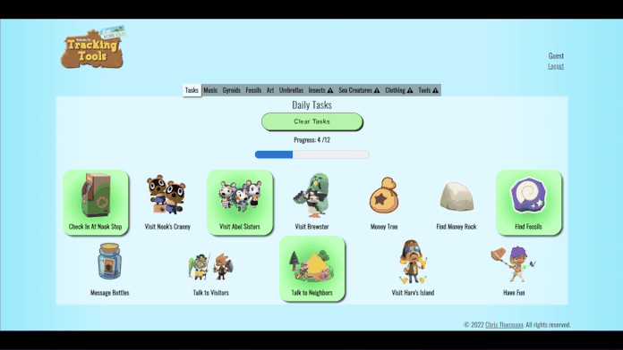

  
  
  
  
  

It all started when I first disassembled my Game Boy. Since then I have been using technology to make tools that make our lives easier. 

See [my website](https://www.christhompsondev.com/) for more information!

<h1 align="center">Projects</h1>
<table bordercolor="#66b2b2">
  
  <tr>
    <td width="50%" valign="top">
      <h3 align="center">ACNH Tracking Tools</h3>
         
        
         
        

          
    
  
      

        
<strong>HTML5, CSS3, Javascript, Node.js & MongoDB</strong> - A Fullstack, MVC, App to help players keep track of in game collectibles in Animal Crossing: New Horizons! Complete with user logins. 

    </td>
    <td width="50%" valign="top">
      <h3 align="center">Restaurant Savore</h3>
         
      
         
        

          
  
  
      

        
<strong>HTML5, CSS3, & Javascript</strong> - This is a site that I built for a 5 star restaurant. It is a clean and open layout allowing for plenty of text and background images.

    </td>
  </tr>
  
  <tr>
    <td width="50%" valign="top">
      <h3 align="center">ChrisThompsonDev.com</h3>
       
        
       
        

  
  
      

        
<strong>HTML5, CSS3, & Javascript</strong> - Portfolio Site including links to my projects and ways to get in contact with me.

    </td>
    <td width="50%" valign="top">
      <h3 align="center">Landing Page Baisc</h3>
         
        
         
        

          
  
  
      

        
<strong>HTML5, CSS3, & Javascript</strong> - A simple landing site for any business. Built using mobile first ideology and using JS for the collapsible menu icon.

    </td>
  </tr>
</table>

<h1 align="center">Technologies</h1>

    
    
    
    
    
    

<!--     
      
    
    
    
    
    
    
    
    
    
    
    
    

     -->

---

<h1 align="center">Connect</h1>

  
  
  
  
  

